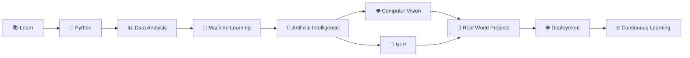
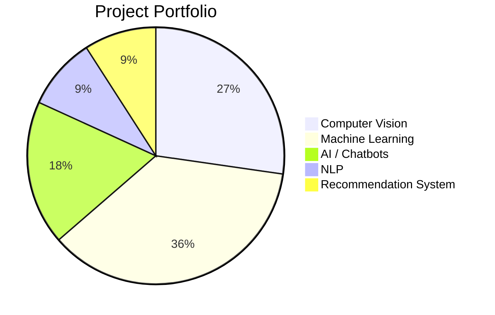
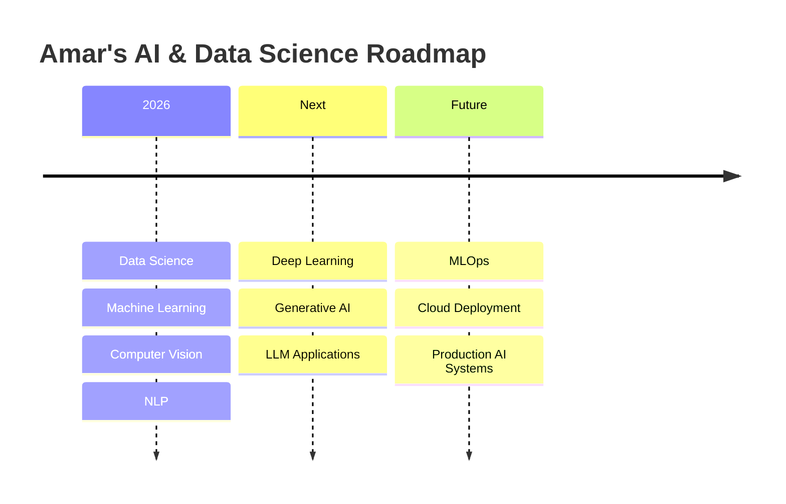

<div align="center">

# 👋 Hey, I'm **AMAR CHAND TIGAYA PUSHKAR**


<br>

<a href="https://github.com/amarchand-tigaya-pushkar">

</a>

<a href="https://www.linkedin.com/in/amarchand-tigaya-pushkar">

</a>

<br><br>


</div>

---

# 🧠 WHO AM I?

```python
class AmarChandTigayaPushkar:

    name = "Amar Chand Tigaya Pushkar"
    role = "Data Science & AI Enthusiast"

    fields = [
        "Data Science",
        "Machine Learning",
        "Artificial Intelligence",
        "Computer Vision",
        "Natural Language Processing",
        "Generative AI"
    ]

    primary_language = "Python"

    philosophy = "Learn → Build → Deploy → Improve"
```

> 🚀 **Turning data into insights, models into solutions, and ideas into real-world AI applications.**

I enjoy exploring the intersection of **Data Science, Machine Learning, Artificial Intelligence and software development** to create practical projects and continuously improve my technical skills.

---

# 📊 MY DATA SCIENCE JOURNEY



---

# 🛠️ TECHNOLOGY STACK

## 🐍 Programming

<p align="center">


</p>

---

## 📊 Data Science & Analytics

<p align="center">


</p>

<p align="center">


</p>

---

## 🤖 Machine Learning

<p align="center">


</p>

---

## 🧠 Artificial Intelligence

<p align="center">


</p>

---

## 👁️ Computer Vision

<p align="center">


</p>

---

## 💬 NLP & Chatbots

<p align="center">


</p>

---

## 🌐 Development & Tools

<p align="center">


</p>

---

# 🚀 PROJECT PORTFOLIO

## 🧍 01 — Human Action Recognition

> Computer Vision / AI project focused on recognizing human actions.

**Focus**

`Computer Vision` • `AI` • `Action Recognition` • `Deep Learning`

🔗 **Repository:**
https://github.com/amarchand-tigaya-pushkar/Human-Action-Recognition

---

## 🧍 02 — Human Action Recognition 9

> Human activity recognition project focused on identifying different actions from visual data.

**Focus**

`Computer Vision` • `Machine Learning` • `Action Classification`

🔗 **Repository:**
https://github.com/amarchand-tigaya-pushkar/Human-Action-Recognition-9

---

## 🌦️ 03 — Weather Prediction

> Machine Learning project for weather prediction using historical data.

**Focus**

`Python` • `Pandas` • `Machine Learning` • `Data Analysis`

🔗 **Repository:**
https://github.com/amarchand-tigaya-pushkar/weather_prediction_project

---

## 🤖 04 — AI Coding Assistant Bot

> AI-powered coding assistant designed to help with programming-related tasks.

**Focus**

`Python` • `AI` • `Automation` • `Coding Assistant`

🔗 **Repository:**
https://github.com/amarchand-tigaya-pushkar/project-20-ai-coding-assistant-bot-project

---

## 💬 05 — Customer Support Chatbot

> Conversational AI project designed for automated customer support.

**Focus**

`NLP` • `AI` • `Chatbot` • `Automation`

🔗 **Repository:**
https://github.com/amarchand-tigaya-pushkar/project-18-customer-support-chatbot-project

---

## 🪖 06 — Helmet Detection

> Computer Vision project focused on helmet detection.

**Focus**

`Computer Vision` • `Object Detection` • `AI`

🔗 **Repository:**
https://github.com/amarchand-tigaya-pushkar/helmet_dataset

---

## 💳 07 — Credit Card Fraud Detection

> Machine Learning project focused on identifying potentially fraudulent transactions.

**Focus**

`Classification` • `Machine Learning` • `Fraud Detection`

🔗 **Repository:**
https://github.com/amarchand-tigaya-pushkar/credit_card_fraud_project

---

## 😊 08 — Sentiment Analysis

> NLP project for analyzing sentiment in text.

**Focus**

`NLP` • `Natural Language Processing` • `Machine Learning`

🔗 **Repository:**
https://github.com/amarchand-tigaya-pushkar/sentiment_analysis_project

---

## 🎵 09 — Music Recommendation System

> Recommendation system designed to suggest music using data-driven techniques.

**Focus**

`Recommendation System` • `Python` • `Machine Learning`

🔗 **Repository:**
https://github.com/amarchand-tigaya-pushkar/music_recommendation_project

---

## 🏦 10 — Loan Approval Prediction

> Machine Learning classification project for predicting loan approval.

**Focus**

`Classification` • `Machine Learning` • `Data Analysis`

🔗 **Repository:**
https://github.com/amarchand-tigaya-pushkar/loan_approval_project

---

## 🚗 11 — Car Price Prediction

> Machine Learning regression project for predicting vehicle prices.

**Focus**

`Regression` • `Machine Learning` • `Python` • `Data Science`

🔗 **Repository:**
https://github.com/amarchand-tigaya-pushkar/car_price_project

---

# 📈 PROJECT CATEGORIES



---

# 🧩 WHAT I BUILD

```text
                    ┌─────────────────────┐
                    │     DATA SCIENCE    │
                    └──────────┬──────────┘
                               │
             ┌─────────────────┼─────────────────┐
             │                 │                 │
             ▼                 ▼                 ▼
       📊 DATA ANALYSIS   🤖 MACHINE LEARNING   🧠 AI
             │                 │                 │
             │          ┌──────┼──────┐          │
             │          │      │      │          │
             ▼          ▼      ▼      ▼          ▼
          Insights   Regression Classification  NLP
                              │                 │
                              ▼                 ▼
                        Predictions         Chatbots
                              │
                              ▼
                         🚀 Deployment
```

---

# 📊 GITHUB ANALYTICS

<div align="center">


</div>

---

# 🔥 CONTRIBUTION STREAK

<div align="center">


</div>

---

# 🏆 GITHUB TROPHIES

<div align="center">


</div>

---

# 📈 GITHUB ACTIVITY

<div align="center">


</div>

---

# 🐍 CONTRIBUTION SNAKE

<div align="center">


</div>

---

# 💻 DEVELOPER TERMINAL

```bash
┌──(amar㉿datascience)-[~/AI]
└─$ python journey.py

[+] Initializing Data Science...
[+] Loading Python...
[+] Loading Machine Learning...
[+] Loading Artificial Intelligence...
[+] Loading Computer Vision...
[+] Loading NLP...
[+] Building Projects...
[+] Improving Skills...

████████████████████████████████████████ 100%

STATUS: READY TO BUILD 🚀
```

---

# 📚 CURRENT LEARNING ROADMAP



---

# 🎯 2026 GOALS

| Goal                | Status                 |
| ------------------- | ---------------------- |
| 🐍 Python           | 🟢 Learning & Building |
| 📊 Data Science     | 🟢 Active              |
| 🤖 Machine Learning | 🟢 Active              |
| 👁️ Computer Vision | 🟢 Active              |
| 💬 NLP              | 🟢 Active              |
| 🧠 Generative AI    | 🟡 Exploring           |
| 🚀 MLOps            | 🟡 Learning            |
| ☁️ Cloud Deployment | 🟡 Future Goal         |

---

# ⚡ MY DEVELOPMENT CYCLE

```text
       💡 IDEA
          │
          ▼
       📚 LEARN
          │
          ▼
       🧪 EXPERIMENT
          │
          ▼
       💻 BUILD
          │
          ▼
       📊 ANALYZE
          │
          ▼
       🚀 DEPLOY
          │
          ▼
       🔄 IMPROVE
          │
          └──────────────► 💡 NEXT IDEA
```

---

# 🌐 CONNECT WITH ME

<div align="center">

<a href="https://github.com/amarchand-tigaya-pushkar">

</a>

<a href="https://www.linkedin.com/in/amarchand-tigaya-pushkar">

</a>

</div>

---

# 🧠 CURRENT MINDSET

<div align="center">

### **LEARN 📚 → BUILD 💻 → ANALYZE 📊 → DEPLOY 🚀 → IMPROVE 🔥**

</div>

---

<div align="center">

## ⭐ Thanks for visiting my GitHub profile!

### 🚀 Keep Learning • Keep Building • Keep Growing

<br>


</div>
