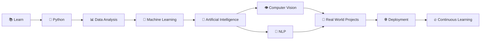
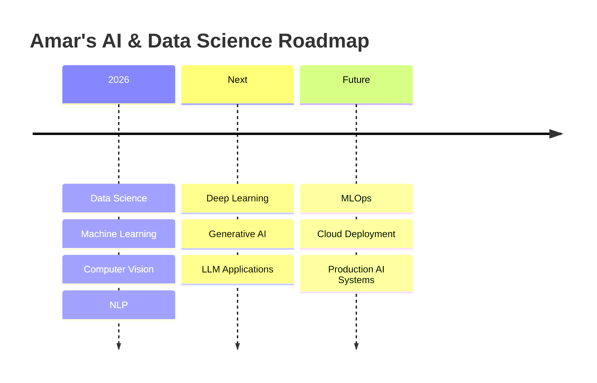

👋 AMAR CHAND TIGAYA PUSHKAR
📊 Data Science • 🤖 Machine Learning • 🧠 AI • 👁️ Computer Vision • 💬 NLP

&nbsp;

🚀 Turning data into insights, models into solutions, and ideas into real-world AI applications.

🧭 PORTFOLIO NAVIGATION

🏠 About	🛠️ Stack	🚀 Projects
📊 Analytics	🗺️ Roadmap	🌐 Connect

🧠 ABOUT ME

👨‍💻 Amar Chand Tigaya Pushkar
📊 Data Science Enthusiast  •  🤖 Machine Learning  •  🧠 Artificial Intelligence

<table>
<tr>
<td align="center" width="25%">

📊
Data Science
Data Analysis

Visualization

Statistics
</td>
<td align="center" width="25%">

🤖
Machine Learning
Prediction

Classification

Regression
</td>
<td align="center" width="25%">

👁️
Computer Vision
Object Detection

Action Recognition

Image Analysis
</td>
<td align="center" width="25%">

💬
AI & NLP
Chatbots

Sentiment Analysis

Generative AI
</td>
</tr>
</table>

🐍 Primary Language

LEARN 📚 → BUILD 💻 → ANALYZE 📊 → DEPLOY 🚀 → IMPROVE 🔥

🔭 WHAT I'M EXPLORING
<table>
<tr>
<td width="50%">

📊 Data Science
- Data Analysis
- Data Visualization
- Predictive Analytics
🤖 Machine Learning
- Regression
- Classification
- Recommendation Systems
</td>
<td width="50%">

🧠 Artificial Intelligence
- Generative AI
- NLP
- AI Applications
👁️ Computer Vision
- Object Detection
- Human Action Recognition
- Image Analysis
</td>
</tr>
</table>

📊 MY DATA SCIENCE JOURNEY

```mermaid
flowchart LR
    A[📚 Learn] --> B[🐍 Python]
    B --> C[📊 Data Analysis]
    C --> D[🤖 Machine Learning]
    D --> E[🧠 Artificial Intelligence]
    E --> F[👁️ Computer Vision]
    E --> G[💬 NLP]
    F --> H[🚀 Real World Projects]
    G --> H
    H --> I[🌐 Deployment]
    I --> J[🔥 Continuous Learning]
```
🛠️ TECHNOLOGY STACK

🐍 Programming

📊 Data Science & Analytics

🤖 Machine Learning

🧠 Artificial Intelligence

👁️ Computer Vision

💬 NLP & Chatbots

🌐 Development & Tools

🚀 PROJECT PORTFOLIO
A visual project showcase designed for quick recruiter scanning.

📊 MACHINE LEARNING & DATA SCIENCE
<table>
<tr>
<td width="50%" valign="top">

🚗 01 — Car Price Prediction
Machine Learning regression project for predicting vehicle prices.
Focus: Regression • Machine Learning • Python • Data Science
🔗 Repository →
</td>
<td width="50%" valign="top">

🏦 02 — Loan Approval Prediction
Machine Learning classification project for predicting loan approval.
Focus: Classification • Machine Learning • Data Analysis
🔗 Repository →
</td>
</tr>

<tr>
<td valign="top">

🌦️ 04 — Weather Prediction
Machine Learning project for predicting weather conditions using historical data.
Focus: Python • Pandas • Machine Learning • Data Analysis
🔗 Repository →
</td>
<td valign="top">

💳 05 — Credit Card Fraud Detection
Machine Learning project focused on detecting potentially fraudulent credit card transactions.
Focus: Machine Learning • Anomaly Detection • Fraud Detection • Isolation Forest
🔗 Repository →
</td>
</tr>

<tr>
<td valign="top">

📈 08 — Stock Price Prediction
Machine Learning regression project for predicting the next-day closing price using historical stock-market data.
Focus: Regression • Machine Learning • Python • Data Science • Time Series
🔗 Repository →
</td>
<td valign="top">

🎼 11 — Music Genre Classification using Machine Learning
Machine Learning classification project for identifying music genres using audio-related features.
Focus: Machine Learning • Classification • Music Analysis • Python
🔗 Repository →
</td>
</tr>
</table>

🧠 NLP & RECOMMENDATION AI
<table>
<tr>
<td width="50%" valign="top">

😊 03 — Sentiment Analysis
Natural Language Processing project for analyzing and classifying sentiment in text.
Focus: NLP • Natural Language Processing • Machine Learning • Naive Bayes
🔗 Repository →
</td>
<td width="50%" valign="top">

🎵 06 — Music Recommendation System
Machine Learning recommendation system designed to suggest similar songs using audio features.
Focus: Recommendation System • Python • Machine Learning • KNN
🔗 Repository →
</td>
</tr>

<tr>
<td valign="top">

🚧 07 — customer-segmentation-kmeans
.
🔗 Repository →
</td>
<td valign="top">

🚧 10 — Project-10-Weather-Agent
Simple Weather Agent using Python
🔗 Repository →
</td>
</tr>
</table>

👁️ COMPUTER VISION & AI
<table>
<tr>
<td width="50%" valign="top">

🧍 09 — Human Action Recognition
Computer Vision / AI project focused on recognizing human actions.
Focus: Computer Vision • AI • Action Recognition • Deep Learning
🔗 Repository →
</td>
<td width="50%" valign="top">

📷 12 — Webcam App using Python
Python-based webcam application for real-time camera interaction.
🔗 Repository →
</td>
</tr>

<tr>
<td valign="top">

🪖 13 — Helmet Detection System
Computer Vision project focused on detecting helmets from visual data.
Focus: Computer Vision • Object Detection • AI
🔗 Repository →
</td>
<td valign="top">

🤖 20 — AI Coding Assistant Bot
AI-powered coding assistant designed to help with programming-related tasks.
Focus: Python • AI • Automation • Coding Assistant
🔗 Repository →
</td>
</tr>
</table>

🤖 AGENTIC AI PROJECTS
<table>
<tr>
<td width="50%" valign="top">

🚧 14 — Currency-Converter-Agent
Simple Currency Converter Agent using Python.
🔗 Repository →
</td>
<td width="50%" valign="top">

🚧 15 — News-Search-Agent
Create an agent that searches latest news by topic.
🔗 Repository →
</td>
</tr>

<tr>
<td valign="top">

🚧 16 — Resume-Screening-Agent
Create an agent that checks a resume and matches it with a job requirement.
🔗 Repository →
</td>
<td valign="top">

🚧 17 — Customer-Support-Agent
Create an agent that answers customer questions automatically..
🔗 Repository →
</td>
</tr>

<tr>
<td valign="top">

🚧 19 — PDF-Question-Answering-Agent
Create an agent that reads a PDF and answers questions from it.
🔗 Repository →
</td>
<td valign="top">

🚧 21 — FAQ-Chatbot
Simple FAQ Chatbot using Python
🔗 Repository →
</td>
</tr>

<tr>
<td valign="top">

🚧 22 — Email-Summarization-Agent
Create an agent that reads an email message and gives a short summary.
🔗 Repository →
</td>
<td valign="top">

🚧 18 — Customer Support Chatbot
Conversational AI project designed for automated customer support.
Focus: NLP • AI • Chatbot • Automation
🔗 Repository →
</td>
</tr>
</table>

📌 PROJECT SNAPSHOT

🧩 Area	🚀 Focus
📊 Data Science	Analysis • Visualization • Predictive Analytics
🤖 Machine Learning	Regression • Classification • Recommendation
🧠 AI	Generative AI • Automation • AI Applications
👁️ Computer Vision	Object Detection • Action Recognition
💬 NLP	Sentiment Analysis • Chatbots
🤖 Agents	Search • Resume • PDF Q&A • Email • Support

📊 PROJECT STATUS
#	Project	Status
01	Car Price Prediction	✅ Available
02	Loan Approval Prediction	✅ Available
03	Sentiment Analysis	✅ Available
04	Weather Prediction	✅ Available
05	Credit Card Fraud Detection	✅ Available
06	Music Recommendation System	✅ Available
07	Coming Soon	✅ Available
08	Stock Price Prediction	✅ Available
09	Human Action Recognition	✅ Available
10	Weather-Agent	✅ Available
11	Music Genre Classification using Machine Learning	✅ Available
12	Webcam App using Python	✅ Available
13	Helmet Detection System	✅ Available
14	Currency-Converter-Agent	✅ Available
15	News-Search-Agent	✅ Available
16	Resume-Screening-Agent	✅ Available
17	Customer-Support-Agent	✅ Available
18	Customer Support Chatbot	✅ Available
19	PDF-Question-Answering-Agent	✅ Available
20	AI Coding Assistant Bot	✅ Available
21	FAQ-Chatbot	✅ Available
22	Email-Summarization-Agent	✅ Available
23	Coming Soon	🚧 Coming Soon
24	Coming Soon	🚧 Coming Soon
25	Coming Soon	🚧 Coming Soon
26	Coming Soon	🚧 Coming Soon
27	Coming Soon	🚧 Coming Soon
28	Coming Soon	🚧 Coming Soon
29	Coming Soon	🚧 Coming Soon
30	Coming Soon	🚧 Coming Soon

🧩 WHAT I BUILD
                    ┌──────────────────────┐
                    │     DATA SCIENCE     │
                    └──────────┬───────────┘
                               │
          ┌────────────────────┼────────────────────┐
          │                    │                    │
          ▼                    ▼                    ▼
   📊 DATA ANALYSIS     🤖 MACHINE LEARNING     🧠 AI
          │                    │                    │
          │              ┌─────┼─────┐              │
          │              │     │     │              │
          ▼              ▼     ▼     ▼              ▼
      Insights       Regression Classification     NLP
                                      │              │
                                      ▼              ▼
                                Predictions       Chatbots
                                      │
                                      ▼
                                🚀 Deployment
📈 GITHUB ANALYTICS

🔥 CONTRIBUTION STREAK

🏆 GITHUB TROPHIES

📈 GITHUB ACTIVITY

🐍 CONTRIBUTION SNAKE

💻 DEVELOPER TERMINAL
┌──(amar㉿datascience)-[~/AI]
└─$ python journey.py

[+] Initializing Data Science...
[+] Loading Python...
[+] Loading Machine Learning...
[+] Loading Artificial Intelligence...
[+] Loading Computer Vision...
[+] Loading NLP...
[+] Building Projects...
[+] Improving Skills...

████████████████████████████████████████ 100%

STATUS: READY TO BUILD 🚀
🗺️ CURRENT LEARNING ROADMAP

```mermaid
timeline
    title Amar's AI & Data Science Roadmap

    2026 : Data Science
         : Machine Learning
         : Computer Vision
         : NLP

    Next : Deep Learning
         : Generative AI
         : LLM Applications

    Future : MLOps
           : Cloud Deployment
           : Production AI Systems
```
🎯 2026 GOALS
Goal	Status
🐍 Python	🟢 Learning & Building
📊 Data Science	🟢 Active
🤖 Machine Learning	🟢 Active
👁️ Computer Vision	🟢 Active
💬 NLP	🟢 Active
🧠 Generative AI	🟡 Exploring
🚀 MLOps	🟡 Learning
☁️ Cloud Deployment	🟡 Future Goal

⚡ MY DEVELOPMENT CYCLE
       💡 IDEA
          │
          ▼
       📚 LEARN
          │
          ▼
       🧪 EXPERIMENT
          │
          ▼
       💻 BUILD
          │
          ▼
       📊 ANALYZE
          │
          ▼
       🚀 DEPLOY
          │
          ▼
       🔄 IMPROVE
          │
          └──────────────► 💡 NEXT IDEA
🌐 CONNECT WITH ME

&nbsp;

LEARN 📚 → BUILD 💻 → ANALYZE 📊 → DEPLOY 🚀 → IMPROVE 🔥

⭐ Thanks for visiting my GitHub profile!

